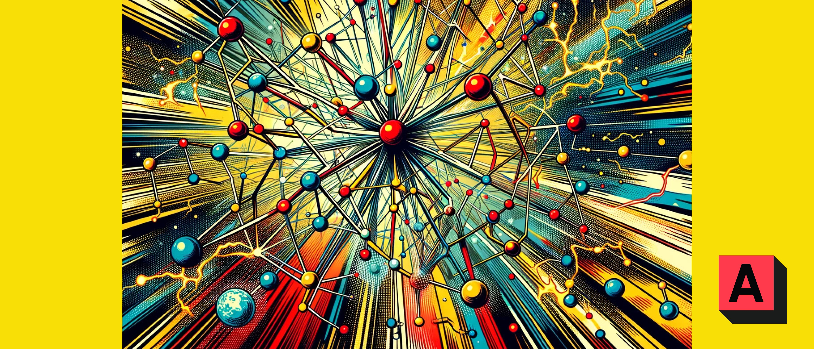

# The AIBlock Network

The AIBlock Network is responsible for all the network-related code in the AIBlock system. It is the repo responsible for communication between nodes in the mining network, as well as integration with the blockchain data structure found in the `Chain` repo. The following are the table of contents for further documentation below, which will fill you in on the architecture of the project as a whole:

- [Node Types](network-wiki/node-types)
- [Mempool Node](network-wiki/mempool-node)
- [Miner Node](network-wiki/miner-node)
- [Storage Node](network-wiki/storage-node)
- [UNiCORNs](network-wiki/unicorns)
- [Transactions](network-wiki/transactions)
- [Block Mining Process](network-wiki/block-mining)
- [2 Way Transactions](network-wiki/two-way-transaction)

# AIBlock Blockchain
To start, it is important to understand how the AIBlock Network fits into the greater AIBlock system. The AIBlock system consists primarily of 2 major components:

- AIBlock Network
- AIBlock Chain

The **AIBlock Network** sends and receives messages that are passed between different node types, and also relays storage to the **AIBlock Chain** in order to keep a record of blockchain history.

## System Architecture
The AIBlock system architecture mirrors much of what you'll find in the Bitcoin architecture, as our blockchain is based on Proof-of-Work (PoW) consensus. Unlike traditional Bitcoin, however, our blockchain is capable of faster transaction speeds (leading to faster clearance periods) and our PoW system is light and more inclusive (but more on this later).

The other major difference between AIBlock and traditional blockchains is the introduction of the 2 way transaction system. Unlike traditional blockchains, our blockchain can record both the movement of tokens *and* the movement of assets for those tokens. Thanks to XGP, those assets can be your ownable and transactable data assets.

To facilitate this, the AIBlock architecture makes use of different types of nodes in its network. You can find out more about the different node types [here](network-wiki/node-types).
