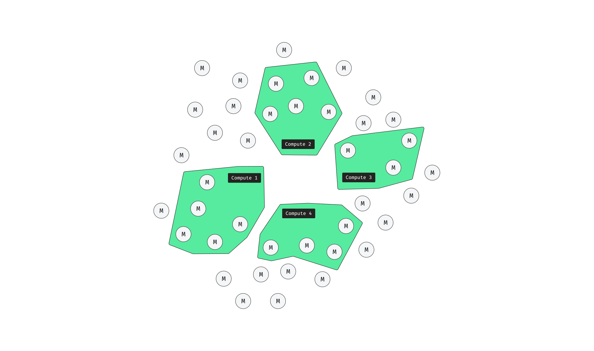

# Miner Node

The Miner node embodies the average miner in the AIBlock system, responsible for mining blocks of transactions and adding them to the blockchain history. Winning miners receive token rewards, and AIBlock employs a more energy-efficient mining method while retaining the useful aspects of [Proof-of-Work (PoW)](https://en.bitcoin.it/wiki/Proof_of_work). Further details on this method are discussed in the [Partitioning](#partitioning) section.

## Balance of Power

A Roman-style balance exists between the Senate-like Mempool nodes and the Public-like Miner nodes, ensuring the trustlessness of the AIBlock system. While Mempool nodes validate and bundle transactions, Miner nodes play a crucial role in mining and adding blocks to Storage nodes. If the majority of Miners reject a Mempool-constructed block, it cannot be added to the ledger. Miners can even choose to reject a dishonest Mempool node, rendering it useless, or in extreme cases, abandon the system altogether.

Fairness in block mining and Miner participation is ensured through the partitioning system, discussed in the next section.

## Partitioning

The partitioning system forms the foundation of the Mempool-Miner balance. Instead of all miners mining each round, a select few are chosen, conserving energy. Miners not chosen can attempt to participate in the next round. The network structure each round is illustrated in the diagram, where only miner nodes inside the orange space can mine for a specific Mempool node:

Each round, Miners can request to join a Mempool node's upcoming block mining. Each Mempool node has a limited number of miners in its partition. Once the partition limit is reached, the block can be sent for mining.

Mempool nodes, upon receiving a Miner's partition request, follow these steps:

- Miner A requests to join Mempool A's partition, containing a small Proof-of-Work to prevent exploitation.
- Mempool A uses the [UNiCORN](unicorns) algorithm to select miners from the partition for the mining process.
- Mempool A provides the block to selected miners, including Miner A, who can start mining.
- Miners have a deterministic time to submit their winning Proof-of-Work.
- At the round's end, Mempool nodes use UNiCORN to select the winning Miner, and the block is sent with their coinbase to Storage nodes.
